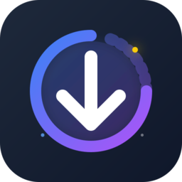

# NebulaDL

<p align="center">
  
</p>

<p align="center">
  <strong>高性能视频下载器</strong><br>
  基于 yt-dlp 构建，支持 4K 视频、播放列表和多线程下载
</p>

<p align="center">
  
  
  
</p>

---

## ✨ 功能特性

- **多格式支持** - 支持 4K、1080p、720p 等多种画质，以及纯音频下载
- **播放列表下载** - 智能识别并批量下载播放列表内容
- **断点续传** - 支持暂停、继续和重试下载任务
- **多线程并发** - 可配置并发数，最大化下载速度
- **Cookie 支持** - 支持导入浏览器 Cookie 下载会员/私有内容
- **下载历史** - 自动记录下载历史，方便管理
- **现代界面** - 基于 pywebview 的原生窗口，美观流畅

## 📦 安装

### 从源码运行

```bash
# 克隆仓库
git clone https://github.com/YourUsername/NebulaDL.git
cd NebulaDL

# 安装依赖
pip install pywebview yt-dlp

# 运行应用
python main.py
```

### 构建可执行文件

```bash
# 安装 PyInstaller
pip install pyinstaller

# 运行构建脚本
./build.bat
```

生成的 `NebulaDL.exe` 位于 `dist/` 目录。

## 🚀 使用方法

1. 启动应用程序
2. 粘贴视频链接到输入框
3. 点击解析，选择所需画质
4. 点击下载，等待完成

### 快捷操作

| 操作 | 说明 |
|------|------|
| 暂停/继续 | 点击下载项的暂停按钮 |
| 取消下载 | 点击下载项的取消按钮 |
| 批量下载 | 多个链接换行粘贴 |
| 打开文件夹 | 点击已完成项的文件夹图标 |

## ⚙️ 配置

设置存储在用户目录下的 `.nebuladl_settings.json`：

| 选项 | 说明 | 默认值 |
|------|------|--------|
| `download_dir` | 下载保存目录 | 用户视频文件夹 |
| `max_concurrent` | 最大并发下载数 | 3 |
| `proxy` | 代理服务器地址 | 无 |

## 🔧 技术栈

- **后端**: Python 3.10+, yt-dlp
- **前端**: HTML, CSS, JavaScript
- **桌面框架**: pywebview (EdgeChromium)
- **打包工具**: PyInstaller

## 📁 项目结构

```
NebulaDL/
├── main.py              # 应用入口
├── core/
│   ├── api.py           # JavaScript 桥接 API
│   ├── downloader.py    # 下载核心逻辑
│   ├── history.py       # 下载历史管理
│   └── license.py       # 许可证验证
├── templates/
│   ├── index.html       # 主界面
│   └── js/app.js        # 前端逻辑
├── assets/
│   └── icon.png         # 应用图标
├── NebulaDL.spec        # PyInstaller 配置
└── build.bat            # 构建脚本
```

## 📄 许可证

本项目采用 MIT 许可证。详见 [LICENSE](LICENSE) 文件。

## 🙏 致谢

- [yt-dlp](https://github.com/yt-dlp/yt-dlp) - 强大的视频下载引擎
- [pywebview](https://github.com/r0x0r/pywebview) - 轻量级桌面 GUI 框架
